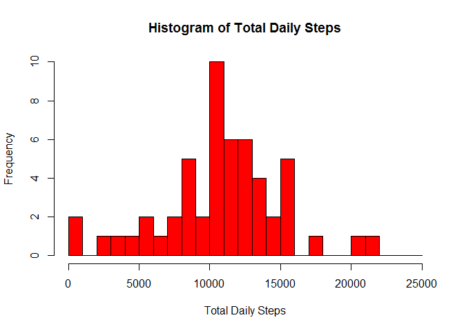
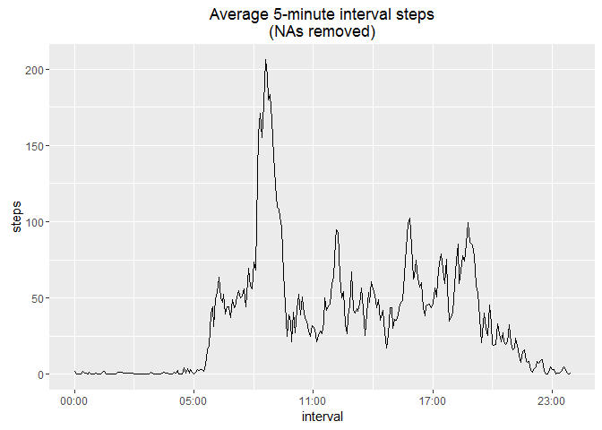
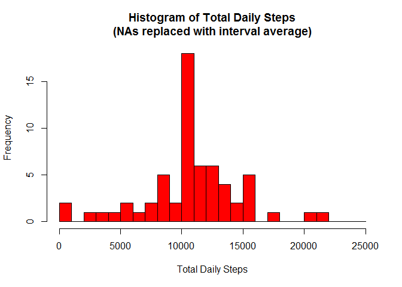
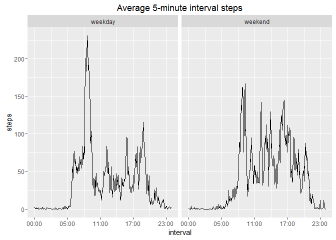

# Reproducible Research: Peer Assessment 1


This assignment makes use of data from a personal activity monitoring
device. This device collects data at 5 minute intervals through out the
day. The data consists of two months of data from an anonymous
individual collected during the months of October and November, 2012
and include the number of steps taken in 5 minute intervals each day.

## Data

The data for this assignment can be downloaded from the course web
site:

* Dataset: [Activity monitoring data](https://d396qusza40orc.cloudfront.net/repdata%2Fdata%2Factivity.zip) [52K]

The variables included in this dataset are:

* **steps**: Number of steps taking in a 5-minute interval (missing
    values are coded as `NA`)

* **date**: The date on which the measurement was taken in YYYY-MM-DD
    format

* **interval**: Identifier for the 5-minute interval in which
    measurement was taken


The dataset is stored in a comma-separated-value (CSV) file and there
are a total of 17,568 observations in this
dataset.

Some housekeeping first


```r
library(dplyr,quietly=TRUE,verbose=FALSE,warn.conflicts = FALSE)
library(ggplot2)
library(scales)     # for ggplot x axis hh:mm formating
library(lubridate)

# pretty real numbers

options(scipen=9,digits=2)

# allows visualisation of inline code in the output

rinline <- function(code) {
  sprintf('``` `r %s` ```', code)
}
```


## Loading and preprocessing the data

### 1. Load the data


```r
url <- "https://d396qusza40orc.cloudfront.net/repdata%2Fdata%2Factivity.zip"


#   get activity.csv file if it doesn't exist

if (!file.exists("activity.csv")) {
  if (!file.exists("activity.zip") ) {
    download.file(url,"activity.zip")
  }
  unzip("activity.zip")
}  

activity <- read.csv("activity.csv")
```

### 2. Process/transform the data into a format suitable for your analysis


```r
activity$date <- as.Date(activity$date)
activity$interval <- as.POSIXct(strptime(sprintf("%04d",activity$interval), "%H%M")) 
```


## What is mean total number of steps taken per day?

### 1. Make a histogram of the total number of steps taken each day


```r
dailySteps <- aggregate(steps~date,sum,data=activity)
 
meanSteps <- mean(dailySteps$steps)    

medianSteps <- median(dailySteps$steps)

hist(dailySteps$steps,
     breaks=seq(0,25000,1000),
     col="red",
     main="Histogram of Total Daily Steps",
     xlab="Total Daily Steps")
```




### 2. Calculate and report the mean and median total number of steps taken per day

The mean of the total number of steps taken per day is 10766.19 ``` `r meanSteps)` ```.

The median of the total number of steps taken per day is 10765 ``` `r medianSteps` ```.


## What is the average daily activity pattern?

### 1. Make a time series plot (i.e. type = "l") of the 5-minute interval (x-axis) and the average number of steps taken, averaged across all days (y-axis)


```r
intervalSteps <- activity[!is.na(activity$steps),] %>%
                 group_by(interval) %>%
                 summarise(steps=mean(steps))
                 
# the tz is necesary to prevent x axis labels from being offset to the data

ggplot(data=intervalSteps, aes(x=interval, y=steps)) +
    geom_line() +
    scale_x_datetime(labels=date_format("%H:%M",tz=Sys.timezone())) +
    ggtitle("Average 5-minute interval steps\n(NAs removed)")
```




### 2. Which 5-minute interval, on average across all the days in the dataset, contains the maximum number of steps?


```r
# interval with the most steps

mostSteps <- intervalSteps[which(intervalSteps$steps == max(intervalSteps$steps)),]
```

The 5-minute interval, on average across all the days in the dataset, which
contains the maximum number of steps is 08:35  ``` `r strftime(mostSteps$interval,"%H:%M")` ```.

This interval has an average of 206.17 steps ``` `r mostSteps$steps` ```.

## Imputing missing values


### 1. Calculate and report the total number of missing values in the dataset (i.e. the total number of rows with NAs)

There are 2304 rows with missing values``` `r sum(is.na(activity$steps))` ```. 

### 2. Devise a strategy for filling in all of the missing values in the data.

The best strategy is to drop the intervals with messing steps. This is because if a day has a missing value in one or more intervals then all the intervals for the day havee missing values. The following table shows that frequency of missing values poer day. There are 288 5-minute intervals in a 24 hour period.


```r
table(activity[is.na(activity$steps),"date"])
```

```
## 
## 2012-10-01 2012-10-08 2012-11-01 2012-11-04 2012-11-09 2012-11-10 
##        288        288        288        288        288        288 
## 2012-11-14 2012-11-30 
##        288        288
```

That said, we will replace NAs with the mean for that interval to satisfy the question.

### 3. Create a new dataset that is equal to the original dataset but with the missing data filled in.


```r
activityFull <- merge(activity,intervalSteps,by="interval")

activityFull$steps <- ifelse(is.na(activityFull$steps.x),
                             activityFull$steps.y,
                             activityFull$steps.x)
```

### 4. Make a histogram of the total number of steps taken each day and Calculate and report the mean and median total number of steps taken per day. Do these values differ from the estimates from the first part of the assignment? What is the impact of imputing missing data on the estimates of the total daily number of steps?


```r
dailyStepsFull <- aggregate(steps~date,sum,data=activityFull)

     
meanStepsFull <- mean(dailyStepsFull$steps)    

medianStepsFull <- median(dailyStepsFull$steps)

hist(dailyStepsFull$steps,
     breaks=seq(0,25000,1000),
     col="red",
     main="Histogram of Total Daily Steps\n(NAs replaced with interval average)",
     xlab="Total Daily Steps")
```



The mean of the total number of steps taken per day is 10766.19 ``` `r meanStepsFull` ```.

The median of the total number of steps taken per day is 10766.19 ``` `r medianStepsFull` ```.

Compared to the values before imputing the NAs, the mean is the same (10766.19 ``` `r meanSteps` ```),  but the median is slightly different (10765 ``` `r medianSteps` ```).

## Are there differences in activity patterns between weekdays and weekends?

###1. Create a new factor variable in the dataset with two levels -- "weekday" and "weekend" indicating whether a given date is a weekday or weekend day.


```r
activityFull$day <- factor(ifelse(wday(activityFull$date) %in% c(1,7),
                             'weekend',
                             'weekday'))
```

###2. Make a panel plot containing a time series plot (i.e. `type = "l"`) of the 5-minute interval (x-axis) and the average number of steps taken, averaged across all weekday days or weekend days (y-axis).


```r
intervalSteps <- activityFull[,c("interval","steps","day")] %>%
                 group_by(interval,day) %>%
                 summarise(steps=mean(steps))
                 
# intervalSteps$time <- as.POSIXct(strptime(sprintf("%04d",intervalSteps$interval), "%H%M"))

# the tz is necesary to prevent x axis labels from being offset

ggplot(data=intervalSteps, aes(x=interval, y=steps)) +
    geom_line() +
    facet_grid(. ~ day) +
    scale_x_datetime(labels=date_format("%H:%M",tz=Sys.timezone())) +
    ggtitle("Average 5-minute interval steps")
```



From the above graph, we see that most of the sustained walking occurs around 08:30 on a week day. We could suggest that this may be when the subject is travelling to work however we don't see increased walking activity in the late afternoon when the subject might be going home. Maybe the children are being taken to school and they go home by themselves. It could be just increased activity preparing for the weekday activities.

These are just a few of the possibilities.

On the weekend we see a higher level of walking across the day than during the week. 
